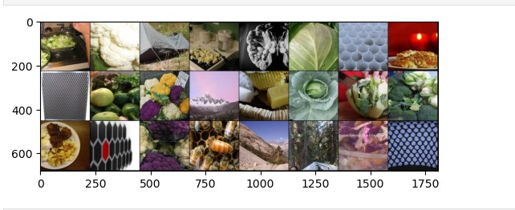
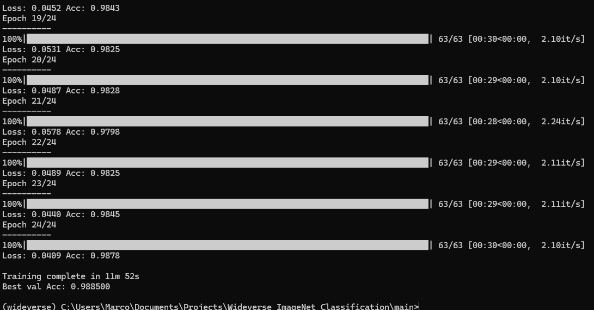

# Wideverse_ImageNet_Classification
Classification with transfer learning of ImageNet subset of data. This is a Kaggle challenge, here you can find the link to the original page: https://www.kaggle.com/competitions/modia-ml-2024/overview

## Challenge Objective
The objective of the challenge is to classify images. In this scenario we have four different possible classes:
1. cauliflower
2. mountain tent
3. head cabbage
4. honeycomb

For each class we have 1000 examples, we can see some of them in the image below.

## Solution Proposed
We use transfer learning to fine tune a ResNet50 and adapt it to the task, in this case recognizing these four classes. ResNet50 is a perfect candidate for this task because it was originally trained on ImageNet, from which this subset was extracted. Applying this strategy, we almost reach a 99% accuracy, as you can see from the exaple blow.

